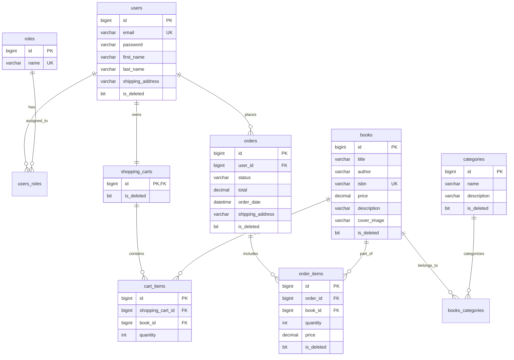
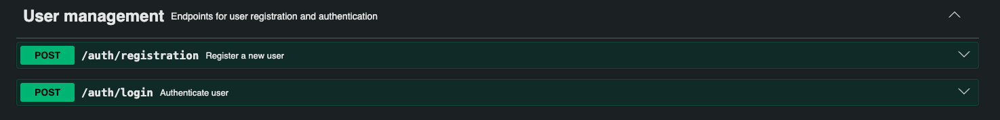
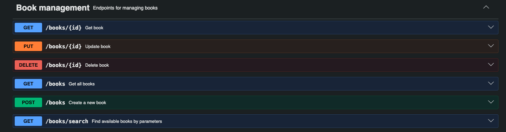
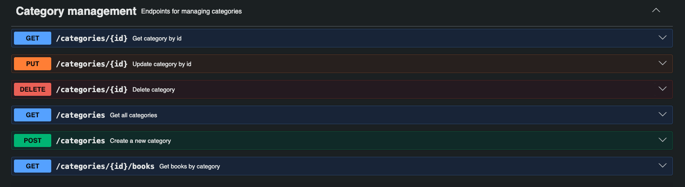
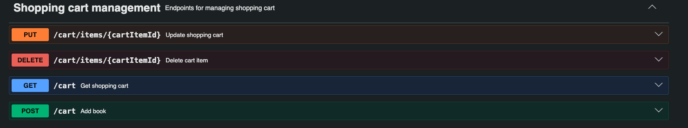
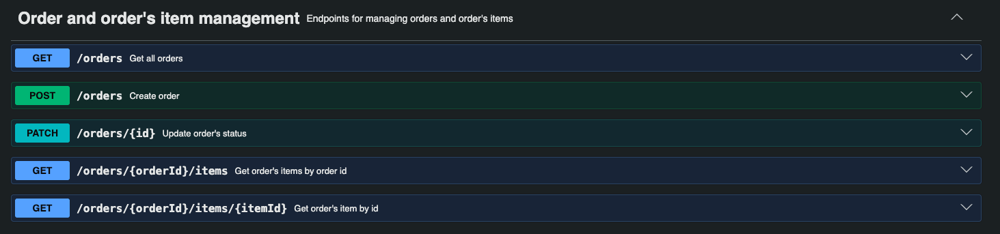

# Online books store backend API

This is a backend api for online book store that covers full books purchase life cycle from looking catalog and book's filtering to managing shopping cart and placing orders

## Technologies and Tools:
* **Language and Core:** Java 17, SpringBoot 4, Maven
* **Security:** Spring Security, JWT
* **Database:** Spring Data JPA, Liquibase, MySQL, Hibernate
* **Containerization:** Docker, Docker Compose
* **Code Generation:** MapStruct, Lombok
* **Testing:** TestContainers, JUnit 5, Mockito, MockMvc
* **Documentation:** Swagger


## Database Model Diagram


## Features and API Endpoints

### 1. [AuthenticationController.java](src/main/java/mate/academy/onlinebookstore/controller/AuthenticationController.java)

Registration and login by getting JWT token



### 2. [BookController.java](src/main/java/mate/academy/onlinebookstore/controller/BookController.java) & [CategoryController.java](src/main/java/mate/academy/onlinebookstore/controller/CategoryController.java)

CRUD operation for book and category. Pagination, sorting and dynamic search by JPA Specification. Only administration can create change and remove.




### 3. [ShoppingCartController.java](src/main/java/mate/academy/onlinebookstore/controller/ShoppingCartController.java)

Add books to shopping cart, updating quantity, remove books from shopping cart.



### 4. [OrderController.java](src/main/java/mate/academy/onlinebookstore/controller/OrderController.java)

Place order by items in shopping cart, order's history, change order's status by administration



## Getting started
Requirements
* Git
* JDK 17 or higher
* Docker Desktop
* Maven 3.8+

1. Clone the repository

```
git clone https://github.com/b1gsal/online-book-store.git
cd online-book-store
```

2. Environment Configuration

Create .env file from the [.env.template](.env.template)
`cp .env.template .env`

Fill in variables in .env

```
MYSQLDB_USER=root
MYSQLDB_PASSWORD=your_password
MYSQLDB_DATABASE=shop
MYSQLDB_LOCAL_PORT=3307
MYSQLDB_DOCKER_PORT=3306
MYSQLDB_ROOT_PASSWORD=your_root_password
MYSQLDB_URL=jdbc:mysql://mysql:3306/shop?serverTimezone=UTC
MYSQLDB_DRIVER=org.hibernate.dialect.MySQLDialect

SPRING_LOCAL_PORT=8081
SPRING_DOCKER_PORT=8080
DEBUG_PORT=5005
```
3. Build the project

Compile the application and package it 

`mvn clean package`
4. Run the application

Option A: Run with docker

Builds app image and runs both MySQL and Spring Boot in docker containers
`docker-compose up --build`

* Application URL: `http://localhost:8081/api`
* Swagger Documentation: `http://localhost:8081/api/swagger-ui.html`

Option B: run with IDE

Launch [OnlineBookStoreApplication.java](src/main/java/mate/academy/onlinebookstore/OnlineBookStoreApplication.java) directly from IDEA

Or `mvn spring-boot:run`

* Application URL: `http://localhost:8080/api`
* Swagger Documentation: `http://localhost:8080/api/swagger-ui.html`

## Swagger Documentation
Interactive OpenAPI documentation is available while the application is running:
* Local run: `http://localhost:8080/api/swagger-ui.html`
* Docker run: `http://localhost:8081/api/swagger-ui.html`

## Postman Collection
A complete Postman collection with pre-configured requests:

File location: [online-book-store.postman_collection.json](online-book-store.postman_collection.json)

How to use:

1. Open Postman and click Import in the upper-left corner.

2. Select the online-book-store.postman_collection.json file from the project root directory.

3. Use the collection requests to test authentication, book searches, cart updates, and orders.

## Challenges and Solutions
* Stateless Security: Implemented JWT-based authentication using custom filters to eliminate HTTP session state on the server.
* Testing: Integrated Testcontainers to spin up disposable MySQL instances during test runs
* Environment Separation: Configured two separate Docker Compose files: docker-compose-dev.yml runs only MySQL for local IDE development, while docker-compose.yml manages the entire multi-container deployment.

## Loom Video Walkthrough: [Watch the demo](https://www.loom.com/share/387bc14f39444753b6b054bee26ed957)
